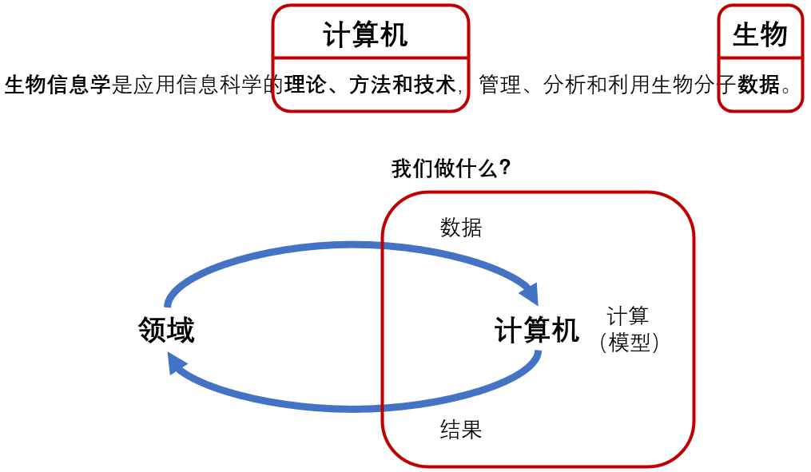

搭建个人网页之后突然觉得有了一个坦诚的表达窗口，可以输出工作中的种种见闻和感受。其实过去三年一直都有以月报的形式定期记录研究生生活，回头看有很多思考十分精彩，体现了我在当时的情景下如何面对问题并解决问题，其中有一些想法做法多少幼稚，有一些又真的好像在那时候“长大了”。这些内容只给老板看还挺可惜的，今后可以尽量多写成博客。  

7月连续外出参会，14日-18日带生信组的小伙伴们到杭州参加[3DGenomics]( http://www.3dgenomics.org/)，20日-24日和可视化组的小伙伴们到重庆参加[ChinaVis]( https://chinavis.org/2023/)。  

## 3DGenomics

3DGenomics是一个生命科学的会议，当初报名的时候就有想到可能会听不懂，但是怀着寻找科学问题+疫情之后见见国际报告世面的想法，还是决定参加。坦诚地说确实听不懂，但是仍然很有收获。结合前半年摸着石头过河的做论文经历，深刻体会到了学科之间科研思路的不同，也总结出个人认为的AI4Science工作模式。

生命科学所研究的问题是非常具体的，对某一个特定的现象，实验验证其作用机制，最终收获自然科学发现。而计算机背景的研究者却往往具有抽象思维，试图提出通用的方法，实现准确的计算和预测。而这之间的Gap比我此前想象的大的太多太多了。举个例子，在写论文或申项目的时候，我们会写大概这样的背景介绍：以生物实验验证A-B的相互作用是耗时耗力的，于是我们提出有效的计算方法以准确预测潜在的A-B相互作用，从而加速生物实验，进而揭示作用机制、辅助疾病诊疗。而在本次3DGenomics会议中，听到UCSF Prof. Yin Shen的报告《Characterize Alzheimer's disease genetic association in the 3D genome》，大致感受了其中的工作流程：首先筛选出三百多个潜在的变异体，然后做一系列实验（真的很多很多，讲了二十几分钟），最终验证了一些变异体-阿尔兹海默症的作用机制。有一位提问者问到如何将这项工作落地应用于疾病诊疗，而Prof. Shen的回答是仍暂时未知、有待进一步探索。我好震惊，简单一句学科交叉惯用表达的背后，其实包含了对方学科巨大的工作量。我们做的预测是“AI4Science”，原来只“4”到了冰山一角：计算机预测的是抽象的节点-节点之间的链路，广泛筛选各种疾病和各种变异体之间的潜在关联，二分类预测有关/无关，好像找到海面上所有的冰凌；而生物实验则针对具体的某一疾病和某些变异体，尽可能地深入挖掘其复杂且独特的作用机制，好像探寻某一整座巨大的冰山。学科交叉找问题、做工作时，如何平衡广度与深度？这很需要经验和智慧。

于是我更新了对生物信息（现在好像更流行称为AI4Science）的认识。以前做了以下左图，意思是数据描述领域问题、计算机实现模型输出结果、结果造福领域问题。而现在认识到二者之间的Gap并不容易弥合，于是做了右图，AI4Science所“4”的是某个精心提取出来的可计算/预测问题。而学科交叉研究中最困难的就是定义好的问题，这需要生物/医学+计算机双方的深入合作，并且需要作者具有一定的影响力：能组织充足的数据、能将定义的新问题推广为Benchmark。在未经深入合作的情况下，计算机背景的研究者对着有限的公开数据尝试定义新问题，这很有可能是一厢情愿、南辕北辙。

<!-- 
 -->

<figure class="half">
     
    
</figure>

所以怎么做AI4Science？或许首先要有“自知之明”，对合作者的意愿、手头数据的质量、创新点是否可靠等各方面都要有所把握。一个虽“勇”但“傻”的例子就是我前半年所做的[EGPMDA](http://arxiv.org/abs/2307.07957)，在没有合作者、只能整合公开数据、需要完全从零设计实验与评估方案的情况下，讨论了可泛化性和可解释性，到投稿阶段也多少受挫。或许在我当前所处的环境中，不考虑扩展问题定义，Follow、模仿再稍稍改进现有的工作会是一种更“经济”的选择。（虽然有点吃亏，但是还是很自豪我想要做出有意义的工作的初心。）

现在VCL实验室生信组有4位同学需要开题，面临着“祖传老题”有点过时、自拟新题不太有把握的情况，我和大家一起想办法。对于硕士毕业这个目标，或许并不需要想得太多，任选一个现在能发的出论文的题，做就完了，上限有限也无所谓。但是如果是博士呢？我也还很没数，或许应该先进入更高水平的环境、接受更多科研指导。如果有机会面试做AI4Science的Lab，我一定要问：**你们怎么选题？**

## ChinaVis

参加ChinaVis是为了报告GBDT4CTRVis，一作Wenwen在外实习，二作Shangsong已经毕业，于是报告的任务就顺延到了我这里。如此的可视分析系统有一个详尽的Pipeline，把它讲清楚就能圆满完成报告了。而构建Pipeline也是可视化研究的难点：一方面具体的模块很多，虽然不要求单独比较是否SOTA，但是环环相扣都不能掉链子，但凡某一个环节被审稿人质疑站不住脚，就几乎没有空间推倒重来了；另一方面实验评估和人有关，在定性（人的感受）之中寻求定量（问卷统计），不如模型比指标来的直接。

## Research Interests

总之在种种经历之中发掘自己真正的研究兴趣。Bioinformatics（AI4Science）很好，但是生物/医学背景深了之后需要更多地与人合作。或者说我更感兴趣的是图数据和相关算法本身，连带着各种表现为图的科学/现实问题。可视化也很好，很锻炼人“讲故事”的能力，有这样的经历未来也总会有所受益。